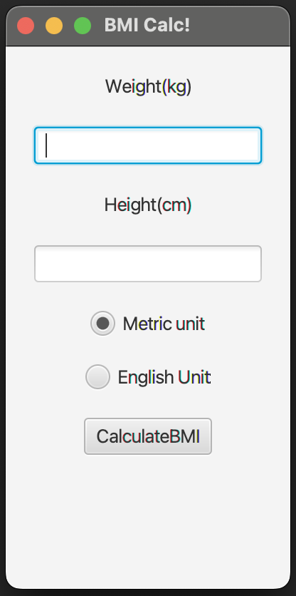

# BMI Calculator

There are two test cases in this assignment, one tests your inputs for Metric and other tests those input for English Units. Please keep the IDs of the GUI components as given in the test cases and try getting the same results for the inputs given in the test cases.

Have a look at the GUI interface of your BMI Calculator:

You are required to write code in the CustomBmiController.java class and develop the GUI using scene builder. Please use IntelliJ Idea for both completing the controller class and FXML (view).

A side note on the test cases, suppose you map a function that handles an event on a button, you are free to choose its name, since the TestFx will clikc on the button like you do.
This is not the case of nodes and their identification, you are bound to keep the node identification using fx:id.

